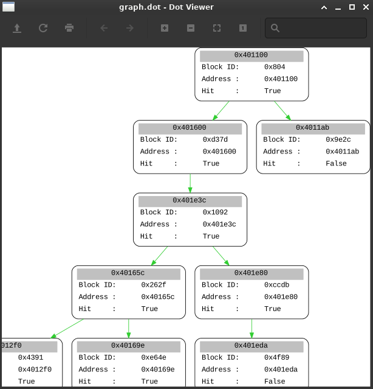
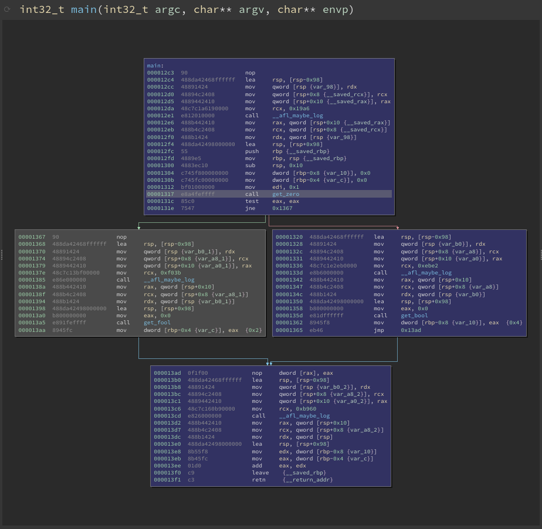
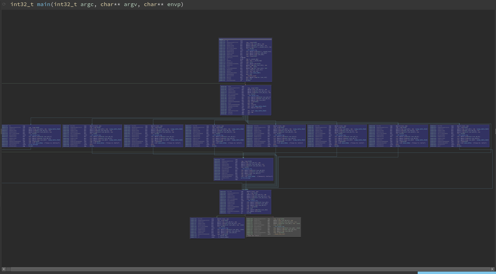
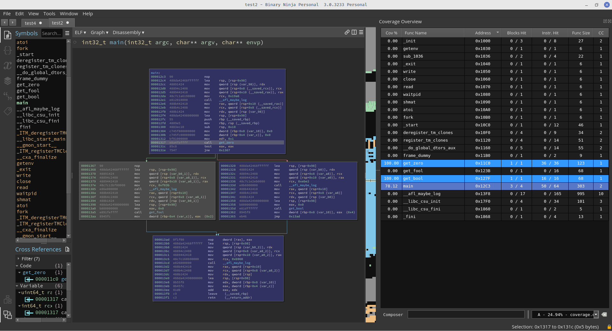

# AFL-Cast

AFL-Cast is a coverage conversion tool which can be used to convert coverage information contained in an AFL bitmap file into an easily visualizable and interpretative format. It can be useful for security researchers to quickly analyse coverage information to gauge fuzzing progress. 

AFL-Cast can be used in tandem with any coverage visualization tool such as [Lighthouse](https://github.com/gaasedelen/lighthouse) to view coverage and get various metrics.

AFL-Cast is meant as a replacement for AFL-showmap which needs to re-run the entire queue in AFL to get coverage information.


Use the cloudfuzz's [miasm](https://github.com/cloudfuzz/miasm) fork to run the script.


## Install

```
# setup miasm
$ git clone https://github.com/cloudfuzz/miasm.git
$ cd miasm
$ python setup.py build
$ sudo python setup.py install

# setup AFL-Cast
$ git clone https://github.com/cloudfuzz/AFL-Cast.git
$ cd AFL-Cast

# examples
$ python covtool.py -i test/afl1/test -b test/afl1/fuzz_bitmap -l 0x00 -g graph.dot -f "main" -o coverage.dump

$ xdot graph.dot
```
<p align="center">
  
</p>

## Compiling binaries using AFL

```
# Setup AFL
$ git clone https://github.com/google/AFL.git
$ cd AFL
$ make

# Setup target
$ make CC=/path/to/AFL/afl-clang CXX=/path/to/AFL/afl-clang-fast++ LD=/path/to/AFL/afl-clang
```

## Example

```
# Setup target and start fuzzing
$ cd test/afl1
$ ~/AFL/afl-clang test.c -o test1
$ mkdir fuzz
$ cp test1 fuzz/test1
$ cd fuzz
$ mkdir in && cp ../test_inp in/test_inp
$ ~/AFL/afl-fuzz -i in/ -o out -m none -d -- ./test1 @@

# Getting the bitmap
$ cd test/afl1/fuzz/out
$ cp fuzz_bitmap ../../../../fuzz_bitmap && cd ../../../../
$ python covtool.py -i test/afl1/fuzz/test_cov -b fuzz_bitmap -l 0x0 -f "main" -o coverage_test1.dump
```

The resulting dump file can be used with [Lighthouse](https://github.com/gaasedelen/lighthouse).

## Screenshots

<p align="center">
  
</p>

<p align="center">
  
</p>

<p align="center">
  
</p>

## Limitations

* Can’t follow some indirect calls missing just the edge between the calling block and the starting block of the function.

* Could fail to identify some edges if the heuristics for identifying jumptables fail

* Could throw out an error of maximum recursion depth exceeded, if the provided binary is large.


## Authors

**Pukit Singh Singaria([@X3eRo0](https://twitter.com/x3ero0))** of **[CloudFuzz](https://cloudfuzz.io)**.

**Siddharth M([@R3x](https://twitter.com/Tr3x__))** of **[CloudFuzz](https://cloudfuzz.io)**.
